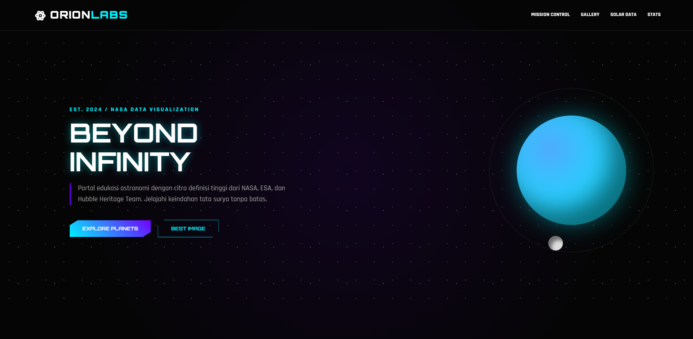
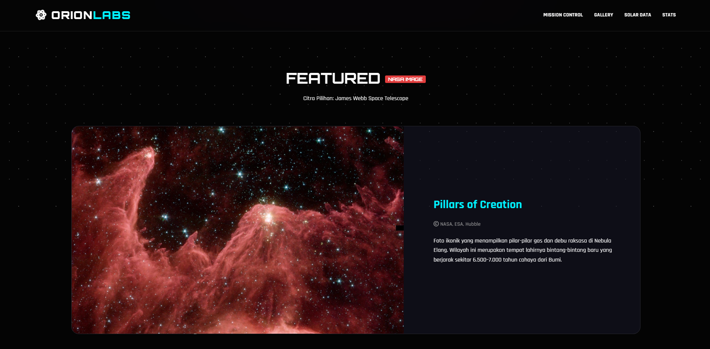
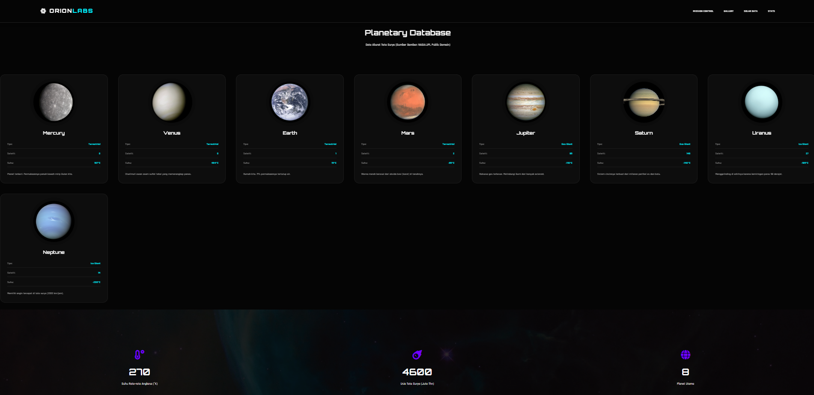

# 🌌 Beyond Infinity - Space Exploration Landing Page

**Beyond Infinity** is a responsive landing page project centered around space exploration and NASA data visualization. This website is designed with a modern, futuristic, and minimalist aesthetic to provide an immersive visual experience of the universe.



---

## 🚀 Key Features

* **Futuristic UI/UX:** A dark-themed design with neon accents and glassmorphism that delivers a high-tech, cinematic feel.
* **Interactive Elements:** Dynamic planet animations and engaging visual components.
* **Data-Driven Concept:** Inspired by real-world data visualizations from NASA, ESA, and the Hubble Heritage Team.
* **Fully Responsive:** Optimized for a seamless experience across all devices (Desktop, Tablet, and Mobile).

---

## 📸 Project Gallery

### Featured Discoveries

*Showcasing iconic cosmic structures like the Pillars of Creation.*

### Planetary Database

*A comprehensive overview of our solar system with technical data.*

---

## 🛠️ Tech Stack

* **HTML5:** Semantic structure for better SEO and accessibility.
* **CSS3 / SCSS:** Custom styling featuring glow effects and Grid/Flexbox layouts.
* **JavaScript:** Powering interactivity and visual asset management.
* **Google Fonts:** Tech/sci-fi themed typography to strengthen the brand identity.

---

## 📂 Folder Structure

```text
├── Image/          # Images Landing Page Preview
├── css/             # Stylesheets (style.css / scss)
├── js/              # JavaScript logic
└── index.html       # Main entry point
